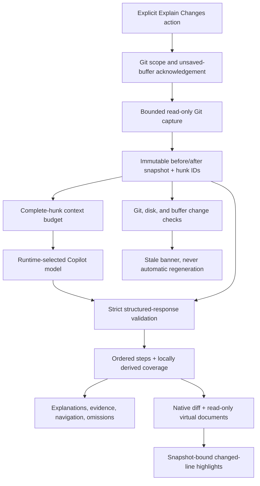

# Design review and implementation decisions

The original handoff's product boundary is retained: help an engineer
understand an agent's changes through evidence-linked native diffs, not through
another code generator, bug detector, or approval workflow.

## Refinements to the handoff

| Decision | Reason |
| --- | --- |
| Ship three clearly named Git scopes, defaulting to all local changes | "After a task" is a trigger, not reliable attribution. Staged and unstaged versions can differ. |
| Use immutable virtual documents on **both** sides | A live modified-side URI could move a valid highlight onto changed code while leaving the old explanation in place. |
| Models return hunk IDs and sides, never paths or line numbers | The extension derives exact changed ranges from a captured diff and rejects references outside the submitted evidence. |
| Derive coverage locally rather than trusting a model's summary | Missing references and context-budget exclusions must not disappear behind a convincing narrative. |
| Represent metadata and unsupported content separately from text hunks | A pure rename, mode change, empty file, conflict, or binary is still a change, even if it cannot have a line highlight. |
| Keep the current walkthrough distinct from next-capture settings | Changing a selector must not relabel the evidence the engineer is already reading. |
| Keep navigation outside the sidebar's scrolling content | The step counter and Previous/Next remain reachable in short windows without covering any explanation text. |
| Collapse setup and detailed provenance while reading | Scope, capture time, coverage, and a verification disclaimer stay discoverable without repeating all setup controls above every step. |
| Turn omission counts into snapshot-bound filters | A human can reach the relevant reasons in one action without losing the full ledger or changing coverage totals. |
| Include a genuinely offline demo | The central interaction can be evaluated without consent, a paid model request, or repository setup. |
| Bound files, bytes, diff work, context, and response size | Large agent edits must not hang the extension or quietly become a partial review. |
| Retain snapshots only in process memory | Avoid writing copies of private source code to a repository, extension storage, or a service. |
| Never repair invalid plans with an automatic second model request | Preserve human control over latency and usage. An explicit retry captures and generates again. |

## Components



`core` and `git` do not import `vscode`. The generic generation adapter accepts
token counting and a streamed response interface. `model/copilot` is the only
production bridge to the Language Model API. Presentation never invokes the
model directly.

## Data contract

`ReviewSnapshot` contains repository identity, scope, capture time, immutable
contents/content IDs, file status and path pairs, hunks, metadata, and
fingerprints for freshness checks. The snapshot is recursively frozen before it
is handed to the model or renderer.

`ReviewHunk` holds a snapshot-bound ID, unified diff context, and separate
old/new **changed-line** ranges. CRLF and CR line endings are normalized only
for hunk computation so editor line references remain useful. Original decoded
UTF-8 snapshot text is retained for the virtual documents.

The model's response is deliberately narrower than the rendering contract:

```json
{
  "snapshotId": "s-...",
  "steps": [
    {
      "title": "Short behavioral change",
      "explanation": "What the supplied evidence shows.",
      "significance": "Why that behavior matters, with inferred intent qualified.",
      "question": "Optional uncertainty for the human reviewer.",
      "references": [
        { "hunkId": "h-...", "side": "new" }
      ]
    }
  ],
  "skipped": [
    { "hunkId": "h-...", "reason": "Why this supplied hunk was intentionally omitted." }
  ]
}
```

`ReviewPlan` is produced only after validation. Each `SourceReference` adds a
resolved file ID and safe, in-bounds line ranges. A step can span several files
and both sides. Repeating a hunk in different steps is permitted; coverage counts
the hunk once. Duplicate references within one step and contradictory skips are
rejected.

Missing model coverage becomes **unexplained**, not implicitly skipped or
approved. Context-budget exclusions are also unexplained, with a distinct
"not sent" reason. Metadata cannot be claimed as line-level coverage.

## Sidebar interaction

The host marks coverage entries matching an allowlisted filter: all changes,
unexplained hunks, unsupported files, skipped hunks, or metadata changes.
Filter messages carry the current snapshot ID and pass the same stale-action
guard as evidence links. Filtering changes presentation only; the complete
ledger and global counts remain intact. Filtered files expand their matching
entries, including empty-result feedback and a route back to all changes.
An explicit filter selection reveals its results beneath sticky filter controls
and the result count. Re-selecting the same filter also reveals the existing
results, without waiting for a changed host state. Scroll offsets are calculated
relative to the sidebar viewport, not with `scrollIntoView`, which can also move
VS Code's ancestor frames. Focus moves to the selected filter only when the
sidebar already has focus; passive status updates preserve reading position.

Navigation availability is derived once in the host state and shared with the
sidebar and VS Code command enablement. Empty plans, invalid indices, and busy
generation disable both directions; boundary steps disable the corresponding
direction. A non-scrolling footer holds navigation, while capture settings and
snapshot details use native keyboard-accessible disclosures with chevrons and
a prominent details header. User disclosure choices
survive navigation within a snapshot and reset for a new capture.

## Capture and freshness

Git is called without a shell using bounded argument arrays, NUL-delimited
records, full object IDs, disabled external diff/textconv/fsmonitor mechanisms,
optional locks disabled, cancellation, and timeouts. Repository-root discovery
must resolve to the opened workspace folder. Model output never supplies Git
arguments.

Old and index sides are read from immutable Git blob IDs. Saved file reads are
bounded, reject symlinks and path escapes, compare file identity around reads,
and are hashed. Capture checks its change manifest and relevant saved contents
again before acceptance. This is an optimistic consistency check, not an atomic
filesystem transaction: another edit can always happen immediately afterwards.
The immutable views remain correct for the captured bytes regardless.

Freshness compares the Git scope manifest and captured working-tree content
hashes. Unsupported files use metadata stamps; their contents were never
accepted as evidence. File events and periodic/focus checks do not open or
refocus editors. Navigation checks freshness before showing captured evidence.
Git-only reviews do not become stale solely because unrelated working buffers
change.

Snapshot document URIs include the snapshot ID, file ID, side, and content ID.
The provider checks the complete expected URI against the in-memory snapshot.
Unknown or forged URIs fail explicitly instead of returning an empty document.
Old snapshots are retained while their virtual documents remain open.

## Trust boundaries

- Git requires a trusted, local, single-folder desktop workspace.
- No automatic saves, source edits, test executions, commits, approvals,
  uploads to a separate backend, or PR submissions are exposed.
- Only user-initiated actions discover models or request generation.
- Filenames and diff text are untrusted prompt data. Prompt instructions
  cannot prove a model will obey; output references and presentation are
  constrained independently.
- The webview has no remote resource access or command URIs. It renders data
  via `textContent`; editor notes use untrusted `MarkdownString.appendText`.
- Sidebar actions are allowlisted and carry only validated indices and opaque
  snapshot/file/hunk IDs. No message can specify an executable, path to read,
  or arbitrary VS Code command.
- Known sensitive-file globs are excluded by default, but this is not
  comprehensive data-loss prevention. The engineer controls what is submitted.
- Correct reference validation does not establish semantic accuracy, complete
  reasoning, successful tests, or a safe change.

## Failure behavior

The sidebar and an actionable VS Code error report distinguish missing Git,
unsupported workspaces, oversized scopes, inconsistent capture, no models,
permission/consent failure, unavailable models, blocked/quota requests, stream
failure, invalid plans, and cancellation.

If capture succeeds but generation fails, the captured files and an explicit
unexplained coverage ledger remain available. There is no fabricated fallback
walkthrough. If no supported text hunks exist, no model is selected or called.
The offline demo is always labeled as fixture content, not generated analysis.

## Pre-release checks

The build uses esbuild's actual input graph to generate third-party notices for
bundled packages, including nested and scoped dependencies. Missing license
metadata or license text fails the build; package-level NOTICE files are
retained too. Development tools are not included merely because they are
installed.

Packaging verifies an explicit set of VSIX entries, exact runtime/UI/document
contents, dependency notices, and matching extension identity. Unexpected
entries, including source maps or private files, fail the check. The package
verifier limits compressed and unpacked archives to 16 MiB; this is a release
tooling limit, not a Git capture limit.

The packaged-host suite extracts only verified entries into a temporary
directory and uses the existing isolated, offline extension-host tests. It
never substitutes a source rebuild for the artifact under test. CI checks the
declared minimum VS Code version and current stable on Linux, with packaging
and unit checks on Windows and Linux. Local executable and version selectors
are mutually exclusive to avoid misleading compatibility results.

The Marketplace publisher is `lukiiiz22`. The package command marks the VSIX
as a pre-release. Publication is a separate explicit step after these checks.

### Linebeam naming and preview migration

The product and public extension identity are Linebeam and
`lukiiiz22.linebeam`. Commands, configuration, color IDs, view IDs, test
environment variables, and release artifacts use the new name. This is a clean
pre-release rename, without aliases for old public commands or settings.

Explicit legacy scope/exclusion settings block capture until their values are
moved to `linebeam.*` and the old keys removed. Default values from an old
configuration registration do not trigger that guard. This prevents silently
broadening the scope or dropping privacy exclusions under a new extension ID.
The required immutable `diffquill:` snapshot protocol remains stable across
the branding change. Do not enable both preview extensions at the same time.

## Future task-aware integration

Keep `publish_review` and MCP adapters outside this MVP. A task-aware publisher
needs a baseline snapshot, ending snapshot, task ID, and provenance for
concurrent/manual edits. Agent-supplied plans must pass the same reference and
coverage validation; "the agent supplied it" is not a trust exemption.

Preview lifecycle hooks may eventually assist capture, but policy or platform
availability must not disable the core Git-scope workflow. Hosted PRs and other
providers should supply the same immutable snapshot contract rather than fork
the explanation or rendering engine.

## Public API references

- [VS Code Language Model API](https://code.visualstudio.com/api/extension-guides/ai/language-model)
- [Virtual documents](https://code.visualstudio.com/api/extension-guides/virtual-documents)
- [Native commands, including vscode.diff](https://code.visualstudio.com/api/references/commands)
- [Language Model Tools, for a future publisher](https://code.visualstudio.com/api/extension-guides/ai/tools)
